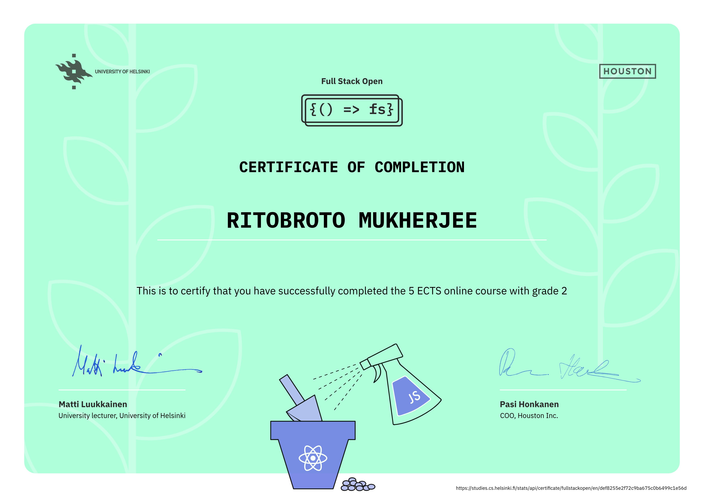

# FullStackOpen Exercises

Contains exercises from the following:
- [x] Part 0: Fundamentals of Web Apps [6/6]
- [x] Part 1: Introduction to React [14/14]
- [x] Part 2: Communicating with server [20/20]
- [x] Part 3: Programming a server with NodeJS and Express [22/22]
- [x] Part 4: Testing Express servers, user administration [23/23]
- [x] Part 5: Testing React apps [23/23]
- [x] Part 6: Advanced state management [24/24]

Links to deployed projects:
- [Phonebook](https://fullstackopen-phonebook-3wu0.onrender.com)
