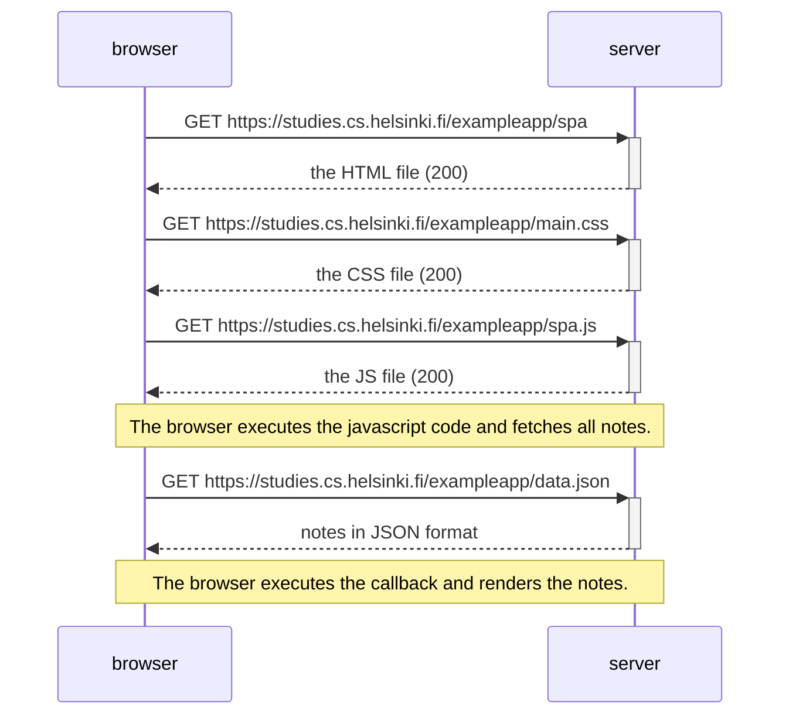

```mermaid
sequenceDiagram
    participant browser
    participant server

    browser->>+server: GET https://studies.cs.helsinki.fi/exampleapp/spa
    server-->>-browser: the HTML file (200)
    
    browser->>+server: GET https://studies.cs.helsinki.fi/exampleapp/main.css
    server-->>-browser: the CSS file (200)
    
    browser->>+server: GET https://studies.cs.helsinki.fi/exampleapp/spa.js
    server-->>-browser: the JS file (200)
    
    Note over browser,server: The browser executes the javascript code and fetches all notes.

    browser->>+server: GET https://studies.cs.helsinki.fi/exampleapp/data.json
    server-->>-browser: notes in JSON format
    
    Note over browser,server: The browser executes the callback and renders the notes.
```

