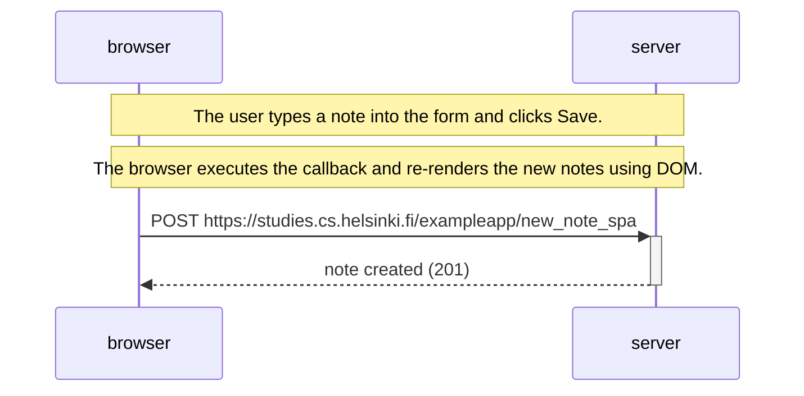

```mermaid
sequenceDiagram
    participant browser
    participant server

    Note over browser,server: The user types a note into the form and clicks Save.
    
    Note over browser,server: The browser executes the callback and re-renders the new notes using DOM.

    browser->>+server: POST https://studies.cs.helsinki.fi/exampleapp/new_note_spa
    server-->>-browser: note created (201)
```

